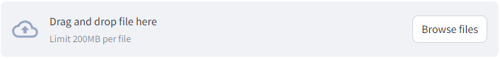
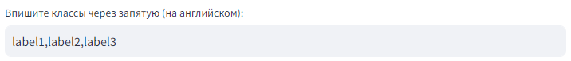

# URFU_ML_PI, group 2.11
## students: Sheshin N.A., Ivanov S.A., Perevispa O.V., Ovchar E.A.

## Перевиспа О.В. [папка perevispa]
### Задание 1: Выбор модели предобученной модели МО и реализация скрипта
Выбран тип модели question-answering, модель timpal0l/mdeberta-v3-base-squad2. 
Скрипт с работой модели [в файле qa.py](https://github.com/nasheshin01/URFU_ML_PI/blob/master/perevispa/qa.py)

### Задание 2: Создание web-приложения МО на локальном компьютере
Ранее выбранная модель перенесена в приложение streamlit. Скриншоты работы приложения в perevispa/scshots. Скрипт с приложением на streamlit [в файле qa_stlit.py](https://github.com/nasheshin01/URFU_ML_PI/blob/master/perevispa/qa_stlit.py)

### Задание 3: Создание API-интерфейса для модели МО на локальном компьютере
Ранее выбранная модель пренесена в скрипт qa_fapi.py для работы с моделью через запросы API. Реализовано:
- метод GET на главную страницу, который возвращает просто текст, 
- метод POST по адресу /predict/ отрабатывает модель МО
- метод POST по адресу /sqnum/ возвращается квадрат переданного числа. 
Несколько методов созданы для тестирования функционала автоматического создания документация FastAPI. Скриншоты работы в scshots (в том числе скриншот cгенерированной документации). Реализация работы модели через запросы API [в файле qa_fapi.py](https://github.com/nasheshin01/URFU_ML_PI/blob/master/perevispa/qa_fapi.py)

### Задание 4: Развертывание API-интерфейса модели в облаке Yandex.Cloud
- Модель развернута в облаке Яндекс клауд на [http://158.160.48.28:8000](http://158.160.48.28:8000).
- С API-документацией можно ознакомиться по ссылке [http://158.160.48.28:8000/docs](http://158.160.48.28:8000/docs)
- Тип модели `question-answering`, модель `timpal0l/mdeberta-v3-base-squad2`.
- Модель возвращает ответ на вопрос пользователя на основании переданного контекста. Вопрос отправляется методом POST на адрес `http://158.160.48.28:8000/predict/`. Тело запроса: json объект с двумя переменными, в переменной `text` собственно отправляется вопрос к модели. 
_____
**Пример curl запроса:**
```bash
curl -X 'POST' \
  'http://158.160.48.28:8000/predict/' \
  -H 'accept: application/json' \
  -H 'Content-Type: application/json' \
  -d '{
  "text": "Как называется ваша компания?",
  "num": 0
}'
```
______
**Пример 200 ответа (body response):**
```json
{
  "score": 0.9657419323921204,
  "start": 21,
  "end": 29,
  "answer": " IVITECH"
}
```

### Задание 5: Тестирование, GitHub Action
- скрипт с моделью [в файле qa_fapi.py](https://github.com/nasheshin01/URFU_ML_PI/blob/master/perevispa/qa_fapi.py)
- скрипт с тестами [в файле test_qa_fapi.py](https://github.com/nasheshin01/URFU_ML_PI/blob/master/perevispa/test_qa_fapi.py)
- скриншоты [первый](https://github.com/nasheshin01/URFU_ML_PI/blob/master/perevispa/scshots/tests_2023_12_02_1.png), [второй](https://github.com/nasheshin01/URFU_ML_PI/blob/master/perevispa/scshots/tests_2023_12_02_2.png), [третий](https://github.com/nasheshin01/URFU_ML_PI/blob/master/perevispa/scshots/tests_2023_12_02_3.png)

_____
## Шешин Н.А. 
### Задание 1
Выбран тип модели Zero-Shot Image Classification. Модель - openai/clip-vit-large-patch14. В скрипте [clip.py](https://github.com/nasheshin01/URFU_ML_PI/blob/master/SheshinProject/choosed_model/clip.py) представлен пример запуска данной модели.

### Задание 2
Было разработано web-приложение на основе библиотеки streamlit. Данное приложение организует работу с ранее выбранной моделью для классификации изображений на произвольных классах.

Код состоит из:
1. Обертка для модели - [clip_classifier.py](https://github.com/nasheshin01/URFU_ML_PI/blob/master/SheshinProject/clip_classifier.py)
2. Скрипт конструирующий само web-приложение - [streamlit_page.py](https://github.com/nasheshin01/URFU_ML_PI/blob/master/SheshinProject/streamlit_page.py)

Приложение:
- Запускается приложение с помощью команды - ```streamlit run streamlit_page.py```
- Скриншоты работы приложения можно найти в папке [screenshots - app1.png, app2.png, app3.png](https://github.com/nasheshin01/URFU_ML_PI/blob/master/SheshinProject/screenshots)

### Задание 3
В третьей практической работе было реализовано API для классификатора изображений CLIP.
Запросы:
- GET запрос на основную страницу, выдающий описание использования возможных запросов
- GET запрос ```/docs``` - документация API
- POST запрос ```/predict``` - запрос для классификации изображения по выбранным классам. Пример тела запроса:
  ```
  {
      "image_url": "http://images.cocodataset.org/val2017/000000039769.jpg",
      "labels": ["cats", "dogs", "cows"]
  }
  ```
Установка и запуск:
1. Перейти в каталог [SheshinProject](https://github.com/nasheshin01/URFU_ML_PI/blob/master/SheshinProject)
2. Установка зависимостей приложения через команду ```pip install -r .\requirements.txt```
3. Запуск сервера запросов через команду ```uvicorn.exe api_logic:app```

### Задание 4
Для четвертой практической работы wep-приложение из второй практической работы было развернуто с помощью Yandex Cloud.

Доступ к приложения можно получить по данному адресу: http://158.160.85.236:8501/ (Для экономии виртуальная машина была настроена, как прерываемая, поэтому есть вероятность, что сервер не будет доступен)

Инструкция по использованию web-приложения:
1. Необходимо загрузить изображение для классификации.
  
2. В окне ввода необходимо прописать классы через запятую.
  
3. Нажать кнопку "Запустить классификацию", если все было сделано верно, то начнется обработка данных классификатором - процесс может быть длительным (особенно в первый раз). Если какой-то из шагов был пропущен, выведется сообщение об ошибке.
